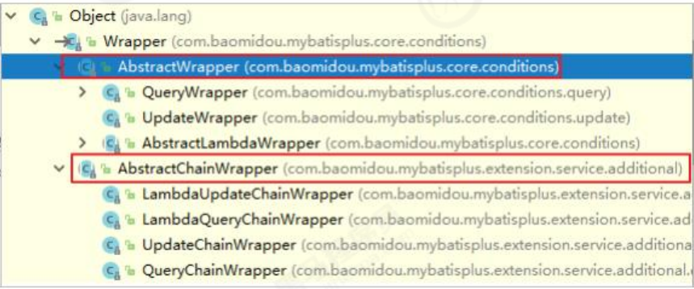

## 1、Mybatis-Plus

### 1.1、Mybatis-Plus介绍

MyBatis-Plus（简称 MP）是一个 MyBatis 的增强工具，在 MyBatis 的基础上只做增强不做任何改变。

官网：https://mybatis.plus/ 或 https://mp.baomidou.com/


### 1.2代码及其文档

文档地址：https://mybatis.plus/guide/

源码地址：https://github.com/baomidou/mybatis-plus

### 1.3、Mybatis-Plus特性

**无侵入**：只做增强不做改变，引入它不会对现有工程产生影响.

**损耗小**：启动即会自动注入基本 CURD，性能基本无损耗，直接面向对象操作

**强大的** **CRUD** **操作**：内置通用 Mapper、通用 Service，仅仅通过少量配置即可实现单表大部分 CRUD 操作。

**支持** **Lambda** **形式调用**：通过 Lambda 表达式，方便的编写各类查询条件。

**支持多种数据库**：支持 MySQL、MariaDB、Oracle、DB2、H2、HSQL、SQLite、Postgre、

SQLServer2005、SQLServer 等多种数据库

**支持主键自动生成**：支持多达 4 种主键策略（内含分布式唯一 ID 生成器 - Sequence），可自由配置，完美解

决主键问题

**支持** **XML** **热加载**：Mapper 对应的 XML 支持热加载，对于简单的 CRUD 操作，甚至可以无 XML 启动

**支持** **ActiveRecord** **模式**：支持 ActiveRecord 形式调用，实体类只需继承 Model 类即可进行强大的 CRUD 操

作

**支持自定义全局通用操作**：支持全局通用方法注入（ Write once, use anywhere ）

**支持关键词自动转义**：支持数据库关键词（order、key......）自动转义，还可自定义关键词

**内置代码生成器**：采用代码或者 Maven 插件可快速生成 Mapper 、 Model 、 Service 、 Controller 层代码，

支持模板引擎，更有超多自定义配置等您来使用

**内置分页插件**：基于 MyBatis 物理分页，开发者无需关心具体操作，配置好插件之后，写分页等同于普通 List

查询

**内置性能分析插件**：可输出 Sql 语句以及其执行时间，建议开发测试时启用该功能，能快速揪出慢查询

**内置全局拦截插件**：提供全表 delete 、 update 操作智能分析阻断，也可自定义拦截规则，预防误操作

**内置** **Sql** **注入剥离器**：支持 Sql 注入剥离，有效预防 Sql 注入攻击

## **2**、快速入门

对于Mbatis整合MP的三种常见方法为：Mybatis+MP,Spring+MyBatis+MP,SpringBoot+Mybatis+MP.

### **2.1**、创建数据库以及表


创建t_user表

```mysql
id` BIGINT(20) NOT NULL AUTO_INCREMENT COMMENT '主键ID',

`user_name` VARCHAR(20) NOT NULL COMMENT '用户名',

`password` VARCHAR(20) NOT NULL COMMENT '密码',

`name` VARCHAR(30) DEFAULT NULL COMMENT '姓名',

`age` INT(11) DEFAULT NULL COMMENT '年龄',

`email` VARCHAR(50) DEFAULT NULL COMMENT '邮箱',

PRIMARY KEY (`id`)

) ENGINE=INNODB AUTO_INCREMENT=1 DEFAULT CHARSET=utf8;
```

插入数据

```chuamysql
INSERT INTO `tb_user` (`id`, `user_name`, `password`, `name`, `age`, `email`) VALUES

('1', 'zhangsan', '123456', '张三', '18', 'test1@itcast.cn');

INSERT INTO `tb_user` (`id`, `user_name`, `password`, `name`, `age`, `email`) VALUES

('2', 'lisi', '123456', '李四', '20', 'test2@itcast.cn');

INSERT INTO `tb_user` (`id`, `user_name`, `password`, `name`, `age`, `email`) VALUES

('3', 'wangwu', '123456', '王五', '28', 'test3@itcast.cn');

INSERT INTO `tb_user` (`id`, `user_name`, `password`, `name`, `age`, `email`) VALUES

('4', 'zhaoliu', '123456', '赵六', '21', 'test4@itcast.cn');

INSERT INTO `tb_user` (`id`, `user_name`, `password`, `name`, `age`, `email`) VALUES

('5', 'sunqi', '123456', '孙七', '24', 'test5@itcast.cn');
```

### 2.2、创建工程

导入依赖：

```xml
   <dependencies>

        <!-- mybatis-plus插件依赖 -->
        <dependency>
            <groupId>com.baomidou</groupId>
            <artifactId>mybatis-plus</artifactId>
            <version>3.1.1</version>
        </dependency>

<!--        mysql-->
        <dependency>
            <groupId>mysql</groupId>
            <artifactId>mysql-connector-java</artifactId>
            <version>5.1.47</version>
        </dependency>
        <!-- 连接池 -->
        <dependency>
            <groupId>com.alibaba</groupId>
            <artifactId>druid</artifactId>
            <version>1.0.11</version>
        </dependency>
        <!--简化bean代码的工具包-->
        <dependency>
            <groupId>org.projectlombok</groupId>
            <artifactId>lombok</artifactId>
            <optional>true</optional>
            <version>1.18.4</version>
        </dependency>

<!--        进行单元测试-->
        <dependency>
            <groupId>junit</groupId>
            <artifactId>junit</artifactId>
            <version>4.12</version>
        </dependency>

        <dependency>
        <groupId>org.slf4j</groupId>
        <artifactId>slf4j-log4j12</artifactId>
        <version>1.6.4</version>
        </dependency>
    </dependencies>

<!--    使用的jdk版本-->
    <build>
        <plugins>
            <plugin>
                <groupId>org.apache.maven.plugins</groupId>
                <artifactId>maven-compiler-plugin</artifactId>
                <configuration>
                    <source>11</source>
                    <target>11</target>
                </configuration>
            </plugin>
        </plugins>
    </build>
```

### 2.3 MyBatis+MP

#### **2.3.1**、创建子Module

子模块继承了父模块的依赖。

log4j.properties：

```properties
log4j.rootLogger=DEBUG,A1

log4j.appender.A1=org.apache.log4j.ConsoleAppender
log4j.appender.A1.layout=org.apache.log4j.PatternLayout
log4j.appender.A1.layout.ConversionPattern=[%t] [%c]-[%p] %m%n
```

#### **2.3.2**、Mybatis实现查询User

第一步，编写mybatis-confifig.xml文件：

```xml
<?xml version="1.0" encoding="UTF-8" ?>
<!DOCTYPE configuration
        PUBLIC "-//mybatis.org//DTD Config 3.0//EN"
        "http://mybatis.org/dtd/mybatis-3-config.dtd">
<configuration>
    <environments default="development">
        <environment id="development">
            <transactionManager type="JDBC"/>
            <dataSource type="POOLED">
                <property name="driver" value="com.mysql.jdbc.Driver"/>
                <property name="url" value="jdbc:mysql://localhost:3306/mp?useUnicode=true&amp;characterEncoding=utf8&amp;autoReconnect=true&amp;allowMultiQuerie s=true&amp;useSSL=false"/>
                <property name="username" value="root"/>
                <property name="password" value="123456"/>
            </dataSource>
        </environment>
    </environments>
    <mappers>
        <mapper resource="UserMapper.xml"/>
    </mappers>
</configuration>
```

**第二步，编写**User

```java
public class User {
    private Long id;
    private String userName;
    private String password;
    private String name;
    private Integer age;
    private String email;

    public User() {
    }

    public User(Long id, String userName, String password, String name, Integer age, String email) {
        this.id = id;
        this.userName = userName;
        this.password = password;
        this.name = name;
        this.age = age;
        this.email = email;
    }

    public Long getId() {
        return id;
    }

    public void setId(Long id) {
        this.id = id;
    }

    public String getUserName() {
        return userName;
    }

    public void setUserName(String userName) {
        this.userName = userName;
    }

    public String getPassword() {
        return password;
    }

    public void setPassword(String password) {
        this.password = password;
    }

    public String getName() {
        return name;
    }

    public void setName(String name) {
        this.name = name;
    }

    public Integer getAge() {
        return age;
    }

    public void setAge(Integer age) {
        this.age = age;
    }

    public String getEmail() {
        return email;
    }

    public void setEmail(String email) {
        this.email = email;
    }

    @Override
    public String toString() {
        return "User{" +
                "id=" + id +
                ", userName='" + userName + '\'' +
                ", password='" + password + '\'' +
                ", name='" + name + '\'' +
                ", age=" + age +
                ", email='" + email + '\'' +
                '}';
    }
}

```

**第三步，编写**UserMapper接口：

```java
public interface UserMapper {

    public List<User> findAll();
}
```

**第四步，编写**UserMapper.xml文件：

```xml
<?xml version="1.0" encoding="UTF-8" ?>
<!DOCTYPE mapper
        PUBLIC "-//mybatis.org//DTD Mapper 3.0//EN"
        "http://mybatis.org/dtd/mybatis-3-mapper.dtd">
<mapper namespace="com.cuiwei.mapper.UserMapper">

    <select id="findAll" resultType="com.cuiwei.pojo.User">
        select * from tb_user
    </select>

</mapper>
```

**第五步，编写**TestMybatis测试用例：

```java
public class TestMybatis {

    @Test
    public void findAll() throws  Exception{
        String config = "mybatis-config.xml";
        InputStream inputStream = Resources.getResourceAsStream(config);
        SqlSessionFactory sqlSessionFactory = new SqlSessionFactoryBuilder().build(inputStream);
        SqlSession sqlSession = sqlSessionFactory.openSession();
        UserMapper mapper = sqlSession.getMapper(UserMapper.class);

        //测试查询
        List<User> all = mapper.findAll();
        for (User user : all) {
            System.out.println(user);
        }
    }
}
```

#### **2.3.3**、Mybatis+MP实现查询User

第一步，将UserMapper继承BaseMapper，将拥有了BaseMapper中的所有方法：

```java
public interface UserMapper extends BaseMapper<User> {
}
```

第二步，使用MP中的MybatisSqlSessionFactoryBuilder进程构建：

```java
public class TestMybatisPlus {
        @Test
        public void findAll() throws  Exception{
            String config = "mybatis-config.xml";
            InputStream inputStream = Resources.getResourceAsStream(config);
            SqlSessionFactory sqlSessionFactory = new MybatisSqlSessionFactoryBuilder().build(inputStream);
            SqlSession sqlSession = sqlSessionFactory.openSession();
            UserMapper mapper = sqlSession.getMapper(UserMapper.class);

            //测试查询
            List<User> users = mapper.selectList(null);
            for (User user: users) {
                System.out.println(user);
            }
        }
    }
```

这里报出了一个错误：


这里是因为MyBatis默认找的数据库表名为实体对象名称的小写，所以找不到该表。

解决方法就是在实体类中指定表名：

在实体类中添加：@TableName("tb_user")

### 2.4、Spring + Mybatis + MP

引入了Spring框架，数据源、构建等工作就交给了Spring管理。

2.4.1、创建子Module

导入依赖：

```xml
<properties>
    <spring.version>5.1.6.RELEASE</spring.version>
</properties>

<dependencies>
    <dependency>
        <groupId>org.springframework</groupId>
        <artifactId>spring-webmvc</artifactId>
        <version>${spring.version}</version>
    </dependency>
    <dependency>
        <groupId>org.springframework</groupId>
        <artifactId>spring-jdbc</artifactId>
        <version>${spring.version}</version>
    </dependency>
    <dependency>
        <groupId>org.springframework</groupId>
        <artifactId>spring-test</artifactId>
        <version>${spring.version}</version>
    </dependency>
</dependencies>
```


**2.4.2** 、实现查询User

第一步，编写jdbc.properties

```properties
jdbc.driver=com.mysql.jdbc.Driver
jdbc.url=jdbc:mysql://localhost:3306/mp?useUnicode=true&characterEncoding=utf8&autoReconnect=true&allowMultiQueries=true&useSSL=false
jdbc.username=root
jdbc.password=123456
```

第二步，编写applicationContext.xml

```xml
<?xml version="1.0" encoding="UTF-8"?>
<beans xmlns="http://www.springframework.org/schema/beans"
       xmlns:xsi="http://www.w3.org/2001/XMLSchema-instance"
       xmlns:context="http://www.springframework.org/schema/context"
       xsi:schemaLocation="http://www.springframework.org/schema/beans
http://www.springframework.org/schema/beans/spring-beans.xsd
http://www.springframework.org/schema/context
http://www.springframework.org/schema/context/spring-context.xsd">


<!--    开启properties文件的扫描器-->
    <context:property-placeholder location="classpath:*.properties"/>

    <!-- 定义数据源 -->
    <bean id="dataSource" class="com.alibaba.druid.pool.DruidDataSource"
          destroy-method="close">
        <property name="url" value="${jdbc.url}"/>
        <property name="username" value="${jdbc.username}"/>
        <property name="password" value="${jdbc.password}"/>
        <property name="driverClassName" value="${jdbc.driver}"/>
        <property name="maxActive" value="10"/>
        <property name="minIdle" value="5"/>
    </bean>
    
    
<!--    这里使用MP提供的sqlSessionFactory，完成对Spring与MP的整合-->
    <bean id="sqlSessionFactory" class="com.baomidou.mybatisplus.extension.spring.MybatisSqlSessionFactoryBean">
        <property name="dataSource" ref="dataSource"></property>
    </bean>
    
<!--    扫描mapper的扫描器 生成mapper的代理对象-->
    <bean class="org.mybatis.spring.mapper.MapperScannerConfigurer">
        <property name="basePackage" value="com.cuiwei.mapper"></property>
    </bean>
</beans>
```

第三步，编写User对象以及UserMapper接口：

```java
public interface UserMapper extends BaseMapper<User> {
}
```

```java
@TableName("tb_user")
public class User {
    private Long id;
    private String userName;
    private String password;
    private String name;
    private Integer age;
    private String email;

    public User() {
    }

    public User(Long id, String userName, String password, String name, Integer age, String email) {
        this.id = id;
        this.userName = userName;
        this.password = password;
        this.name = name;
        this.age = age;
        this.email = email;
    }

    public Long getId() {
        return id;
    }

    public void setId(Long id) {
        this.id = id;
    }

    public String getUserName() {
        return userName;
    }

    public void setUserName(String userName) {
        this.userName = userName;
    }

    public String getPassword() {
        return password;
    }

    public void setPassword(String password) {
        this.password = password;
    }

    public String getName() {
        return name;
    }

    public void setName(String name) {
        this.name = name;
    }

    public Integer getAge() {
        return age;
    }

    public void setAge(Integer age) {
        this.age = age;
    }

    public String getEmail() {
        return email;
    }

    public void setEmail(String email) {
        this.email = email;
    }

    @Override
    public String toString() {
        return "User{" +
                "id=" + id +
                ", userName='" + userName + '\'' +
                ", password='" + password + '\'' +
                ", name='" + name + '\'' +
                ", age=" + age +
                ", email='" + email + '\'' +
                '}';
    }
}
```

第四步，编写测试用例：

```java
@RunWith(SpringJUnit4ClassRunner.class)
@ContextConfiguration(locations ="classpath:applicationContext.xml")
public class TestMyBatisSpring {

    @Autowired
    private UserMapper userMapper;

    @Test
    public void test(){
        List<User> users = userMapper.selectList(null);
        for (User user : users) {
            System.out.println(user);
        }

    }
}
```

### **2.5**、SpringBoot + Mybatis + MP

#### **2.5.1**、创建工程

#### 2.5.2导入依赖

```xml
<?xml version="1.0" encoding="UTF-8"?>
<project xmlns="http://maven.apache.org/POM/4.0.0"
         xmlns:xsi="http://www.w3.org/2001/XMLSchema-instance"
         xsi:schemaLocation="http://maven.apache.org/POM/4.0.0 http://maven.apache.org/xsd/maven-4.0.0.xsd">
    <modelVersion>4.0.0</modelVersion>
    
       <parent>
        <groupId>org.springframework.boot</groupId>
        <artifactId>spring-boot-starter-parent</artifactId>
        <version>2.1.4.RELEASE</version>
    </parent>

    <groupId>com.cuiwei</groupId>
    <artifactId>itcuiwei-mp-springboot</artifactId>
    <version>1.0-SNAPSHOT</version>

    <dependencies>
        <dependency>
            <groupId>org.springframework.boot</groupId>
            <artifactId>spring-boot-starter</artifactId>
            <exclusions>
                <exclusion>
                    <groupId>org.springframework.boot</groupId>
                    <artifactId>spring-boot-starter-logging</artifactId>
                </exclusion>
            </exclusions>
        </dependency>
        <dependency>
            <groupId>org.springframework.boot</groupId>
            <artifactId>spring-boot-starter-test</artifactId>
            <scope>test</scope>
        </dependency>
        <!--简化代码的工具包-->
        <dependency>
            <groupId>org.projectlombok</groupId>
            <artifactId>lombok</artifactId>
            <optional>true</optional>
        </dependency>
        <!--mybatis-plus的springboot支持-->
        <dependency>
            <groupId>com.baomidou</groupId>
            <artifactId>mybatis-plus-boot-starter</artifactId>
            <version>3.1.1</version>
        </dependency>
        <!--mysql驱动-->
        <dependency>
            <groupId>mysql</groupId>
            <artifactId>mysql-connector-java</artifactId>
            <version>5.1.47</version>
        </dependency>
        <dependency>
            <groupId>org.slf4j</groupId>
            <artifactId>slf4j-log4j12</artifactId>
        </dependency>
    </dependencies>
    <build>
        <plugins>
            <plugin>
                <groupId>org.springframework.boot</groupId>
                <artifactId>spring-boot-maven-plugin</artifactId>
            </plugin>
        </plugins>
    </build>

</project>
```

导入日志文件：

log4j.properties：

```properties
log4j.rootLogger=DEBUG,A1
log4j.appender.A1=org.apache.log4j.ConsoleAppender
log4j.appender.A1.layout=org.apache.log4j.PatternLayout
log4j.appender.A1.layout.ConversionPattern=[%t] [%c]-[%p] %m%n
```

#### **2.5.3**、编写application.properties

```properties
spring.application.name = itcuiwei-,p-springboot
spring.datasource.driver-class-name=com.mysql.jdbc.Driver
spring.datasource.url=jdbc:mysql://localhost:3306/mp?
useUnicode=true&characterEncoding=utf8&autoReconnect=true&allowMultiQueries=true&useSSL=false
spring.datasource.username=root
spring.datasource.password=123456
```

#### **2.5.4**、编写****pojo

```java
@Data
@NoArgsConstructor
@AllArgsConstructor
@TableName("tb_user")
public class User {
private Long id;
private String userName;
private String password;
private String name;
private Integer age;
private String email;
}
```

#### **2.5.5**、编写mapper

```java
public interface UserMapper extends BaseMapper<User> {
}
```

#### **2.5.6**、编写启动类

```java
@MapperScan("cn.itcast.mp.mapper") //设置mapper接口的扫描包
@SpringBootApplication
public class MyApplication {
    public static void main(String[] args) {
        SpringApplication.run(MyApplication.class, args);
    }
}
```

#### **2.5.7**、编写测试用例


```java
@RunWith(SpringJUnit4ClassRunner.class)
@SpringBootTest
public class TestSpringBoot {


    @Autowired
    private UserMapper userMapper;

    @Test
    public void test(){
        List<User> users = userMapper.selectList(null);
        for (User user : users) {
            System.out.println(user);
       }
    }
}
```

## 3.、通用CRUD

### **3.1**、插入操作

#### 3.1.1、方法定义

```java
int insert(T entity);
```

#### 3.1.2、测试用例

```java
@RunWith(SpringJUnit4ClassRunner.class)
@SpringBootTest
public class TestUserMapper {
    @Autowired
    private UserMapper userMapper;

    @Test
    public void test(){
        User user = new User();
        user.setEmail("@111.com");
        user.setAge(30);
        user.setUserName("caocao");
        user.setName("曹操");
        user.setPassword("705040");
        int result = userMapper.insert(user);
        System.out.println("result=>" + result);


    }

}
```

注意，这里的result返回的是受影响的行数

#### **3.1.3**、测试


我们可以看到，这里的ID并不是我们想要的，其实这是MP自己的ID策略，如果想要使其成为我们数据库自增的ID，我们需要在User实体类的ID上添加一定的规范，使其自增。

```java
@TableId(type = IdType.AUTO)
```

####  3.1.4、@TableField

在MP中通过@TableField注解可以指定字段的一些属性，常常解决的问题有2个：

1、对象中的属性名和字段名不一致的问题（非驼峰）

像这样：


2、对象中的属性字段在表中不存在的问题

在实体类中如果有一个字段在数据库中是不存在，如果我们给它设置值进行数据库操作是会报错的。我我们可以使用**@TableField(exit = false)**来设置其不参加数据库的相关操作。

3、有时候我们执行查询的时候我们不想查询某一个字段的值，我们可以在实体类的该字段使用**TableField(select = false)**来让其禁止查询该字段。

### 3.2、更新操作

在MP中，更新操作有2种，一种是根据id更新，另一种是根据条件更新。

#### 3.2.1、根据id更新

```java
//更新操作（根据ID进行更新）
@Test
public void testUpdateID(){
    User user = new User();
    user.setId(1L);
    user.setEmail("888888@qq.com");
    int i = userMapper.updateById(user);
    System.out.println("i==>" + i);

}
```


#### **3.2.2**、根据条件更新

```java
    //更新操作（根据条件进行更新）
    @Test
    public void testUpdate(){
        User user = new User();
        user.setAge(20);
        user.setPassword("456123");
        QueryWrapper<User> wrapper = new QueryWrapper<>();
        wrapper.eq("user_name","zhangsan"); //匹配user_name = zhangsan的数据
        //根据条件进行更新
        int update = userMapper.update(user, wrapper);
        System.out.println("update" + update);
    }
}
```


另外一种方式

```java
//更新操作（根据条件进行更新）
@Test
public void testUpdate2(){
    UpdateWrapper<User> wrapper = new UpdateWrapper<>();
    //设置我们的更新字段
    wrapper.set("age",21).set("password","999999")
            //设置条件
    .eq("user_name","wangwu");

    int update = userMapper.update(null, wrapper);
    System.out.println("update" + update);
}
```

注意，这里设置的字段是和数据库的字段保持一致的，而不是和是实体类中的字段一致。


  两种方式的区别就是，第一种方式需要将我们要更新的数据通过一个对象来传递到userMapper.update中。第二种方式则可以直接通过

 wrapper进行设置更新的数据和条件，前面的就不需要了，，直接设置为NULL。

### **3.3**、删除操作

#### **3.3.1**、deleteById

```java
//删除操作（根据ID进行删除）
@Test
public void DeleteID(){
    int i = userMapper.deleteById(5L);
    System.out.println("i====>" + i);
}
```

原来的数据库：


执行完删除操作的数据库：


ID为5的这条数据就没了。

#### **3.3.2**、deleteByMap

可以将删除的条件封装到Map中进行删除操作


```java
//删除操作（Map）

@Test
public void DeleteMap(){

    Map<String,Object> map = new HashMap<>();
    map.put("user_name","zhangsan");
    map.put("password","456123");
    int i = userMapper.deleteByMap(map);
    System.out.println("i===>" + i);
}
```

执行删除前的数据库：


删除后的数据库：


其实Sql语句是：


#### *3.3.3、*delete   wrapper


方法一：

```java
///删除操作
@Test
public void  DeleteWrapper(){
    QueryWrapper<User> wrapper = new QueryWrapper<>();
    wrapper.eq("user_name","zhaoliu").eq("password","123456");
    int delete = userMapper.delete(wrapper);
    System.out.println("i==>" + delete);
}
```

方法二：

```
  ///删除操作
    @Test
    public void  DeleteWrapper(){

        User user = new User();
        user.setUserName("zhaoliu");
        user.setPassword("123456");
        QueryWrapper<User> wrapper = new QueryWrapper<>(user);
        userMapper.delete(wrapper);
    }

}
```

#### **3.3.4**、deleteBatchIds（根据ID批量删除）

```java
//批量删除操作
@Test
public void deletepiliang(){

    int i = userMapper.deleteBatchIds(Arrays.asList(10L, 11L));
    System.out.println("i==>" + i);
}
```

这里就是把ID为10和11的数据删除了。

### 3.4、查询操作

MP提供了多种查询操作，包括根据id查询、批量查询、查询单条数据、查询列表、分页查询等操作。

#### 3.4.1、selectById

方法定义：

```java
T selectById(Serializable id);
```

测试用例：

```java
//查询操作
@Test
public void SelectById(){
    User user = userMapper.selectById(1);
    System.out.println(user);
}
```

结果：


#### **3.4.2**、selectBatchIds（批量查询）

方法定义：

```java
List<T> selectBatchIds(@Param("coll") Collection<? extends Serializable> idList);
```

测试用例：

```java
//查询操作（批量查询）
@Test
public void SelectBatchids(){
    List<User> users = userMapper.selectBatchIds(Arrays.asList(1L, 2L, 3L));
    for (User user : users) {
        System.out.println(user);
    }
}
```

结果：


#### 3.4.3、selectOne（根据条件进行查询）

方法定义：

```java
T selectOne(@Param("ew") Wrapper<T> queryWrapper);
```

测试用例：

```java
//查询操作（根据条件进行查询）
@Test
public void testSelectOne(){
    QueryWrapper<User> wrapper = new QueryWrapper<>();
    wrapper.eq("user_name","guoshiqi");
    User user = userMapper.selectOne(wrapper);
    System.out.println(user);
}
```

结果


注意：

这个方法只适用于查询一条数据，如果你输入的查询条件查询到的不止一条数据，那么会抛出异常。

#### **3.4.4**、selectCount（根据条件查询数据条数）

方法定义：

```java
Integer selectCount(@Param("ew") Wrapper<T> queryWrapper);
```

测试用例：

```java
@Test
public  void SelectAccount(){
    QueryWrapper<User> wrapper = new QueryWrapper<>();
    //查询的条件就是年龄大于20的数据
    wrapper.gt("age",20);
    //根据条件查询数据条数
    Integer integer = userMapper.selectCount(wrapper);
    System.out.println("查询到的数据条数是：" + integer);
}
```

结果：


#### 3.4.5、selectList（根据条件查询多个数据）

方法定义：

```java
List<T> selectList(@Param("ew") Wrapper<T> queryWrapper);
```

测试用例：

```java
//查询操作
@Test
public void SelectList(){
    QueryWrapper wrapper = new QueryWrapper();
    wrapper.like("email","@qq.com");
    List list = userMapper.selectList(wrapper);
    for (Object o : list) {
        System.out.println(o);
    }
}
```

结果：


#### **3.4.6**、selectPage

方法定义：

```java
/**
* 根据  entity 条件，查询全部记录 (并翻页 )  *
* @param page         分页查询条件 (可以为  RowBounds.DEFAULT )
* @param queryWrapper 实体对象封装操作类 (可以为  null )
*/
IPage<T> selectPage(IPage<T> page, @Param(Constants.WRAPPER) Wrapper<T> queryWrapper);
```

配置分页插件：

```java
@Configuration
@MapperScan("com.cuiwei.mapper")
public class MyBatisPlusConfig {

    @Bean//配置一个分页插件
    //配置一个拦截器
    public PaginationInterceptor paginationInterceptor(){
        return new PaginationInterceptor();
    }
}
```

  **注意：**如果想要每个接口都要变成实现类，那么需要在每个接口类上加上@Mapper注解，比较麻烦，解决这个问题用@MapperScan，

@Mapper并不是在编译期间生成实现类，而是在运行时，通过动态代理生成的，指定要变成实现类的接口所在的包，然后包下面的所有接口在运行时通过动态代理都会生成相应的实现类。

测试用例：

```java
//分页查询
    @Test
    public void testSelectPage() {
        QueryWrapper<User> wrapper = new QueryWrapper<User>();
        wrapper.gt("age", 20); //年龄大于20岁
        Page<User> page = new Page<>(1,1);

        //根据条件查询数据
        IPage<User> iPage = this.userMapper.selectPage(page, wrapper);
        System.out.println("数据总条数： " + iPage.getTotal());
        System.out.println("总页数： " + iPage.getPages());
        List<User> users = iPage.getRecords();
        for (User user : users) {
            System.out.println("user = " + user);
        }
    }
```

这里的Ipage可以实现很多方法。

### 3.5、SQL注入的原理

在MP中，ISqlInjector负责SQL的注入工作，它是一个接口，AbstractSqlInjector是它的实现类，实现关系如下：

在AbstractSqlInjector中，主要是由inspectInject()方法进行注入的，如下：

## 4、配置

在MP中有大量的配置，其中有一部分是Mybatis原生的配置，另一部分是MP的配置，详情：https://mybatis.plus/confifig/

### **4.1**、基本配置

#### **4.1.1**、confifigLocation

MyBatis 配置文件位置，如果您有单独的 MyBatis 配置，请将其路径配置到 confifigLocation 中。 MyBatisConfifiguration 的具体内容请参考MyBatis 官方文档

Spring Boot：

```properties
mybatis-plus.config-location = classpath:mybatis-config.xml
```

Spring MVC：

```xml
<bean id="sqlSessionFactory"
class="com.baomidou.mybatisplus.extension.spring.MybatisSqlSessionFactoryBean"> <property name="configLocation" value="classpath:mybatis-config.xml"/>
</bean>
```

#### 4.1.2、mapperLocations

MyBatis Mapper 所对应的 XML 文件位置，如果您在 Mapper 中有自定义方法（XML 中有自定义实现），需要进行该配置，告诉 Mapper 所对应的 XML 文件位置。

Spring Boot：

```properties
mybatis-plus.mapper-locations = classpath*:mybatis/*.xml
```

SpringMVC:

```xml
<bean id="sqlSessionFactory"
class="com.baomidou.mybatisplus.extension.spring.MybatisSqlSessionFactoryBean"> <property name="mapperLocations" value="classpath*:mybatis/*.xml"/>
</bean>
```

这里带*号是扫描所有，不带星号就是默认的resource下的。

userMapper.xml

```xml
<?xml version="1.0" encoding="UTF-8" ?>
<!DOCTYPE mapper
PUBLIC "-//mybatis.org//DTD Mapper 3.0//EN"
"http://mybatis.org/dtd/mybatis-3-mapper.dtd">
<mapper namespace="cn.itcast.mp.mapper.UserMapper">

<select id="findById" resultType="cn.itcast.mp.pojo.User">
select * from tb_user where id = #{id}
</select>
</mapper>
```

```java

import cn.itcast.mp.pojo.User;
import com.baomidou.mybatisplus.core.mapper.BaseMapper;
public interface UserMapper extends BaseMapper<User> {

User findById(Long id);
}
```

测试用例

```java
@Test
public void testSelectPage() {
User user = this.userMapper.findById(2L);
System.out.println(user);
```

#### 4.1.3typeAliasesPackage

MyBaits 别名包扫描路径，通过该属性可以给包中的类注册别名，注册后在 Mapper 对应的 XML 文件中可以直接使用类名，而不用使用全限定的类名（即 XML 中调用的时候不用包含包名）。

Spring Boot：

```xml
 实体对象的扫描包
 mybatis-plus.type-aliases-package = cn.itcast.mp.pojo
```

Spring MVC：

```xml
<bean id="sqlSessionFactory"
class="com.baomidou.mybatisplus.extension.spring.MybatisSqlSessionFactoryBean">
    <property name="typeAliasesPackage" value="com.baomidou.mybatisplus.samples.quickstart.entity"/>
</bean>
```

### **4.2**、进阶配置

#### 4.2.1、mapUnderscoreToCamelCase

类型： boolean

默认值： true

```
  是否开启自动驼峰命名规则( camel case)映射，即从经典数据库列名 A_COLUMN (下划线命名)到经典 Java 属 性名 aColumn (驼峰命名)  的类似映射。
```

注意：

```
此属性在 MyBatis 中原默认值为 false，在 MyBatis-Plus 中，此属性也将用于生成最终的 SQL 的 select body

如果您的数据库命名符合规则无需使用 @TableField 注解指定数据库字段名
```

示例（SpringBoot）：

```
 #关闭自动驼峰映射，该参数不能和mybatis-plus.config-location同时存在 
 2 mybatis-plus.configuration.map-underscore-to-camel-case=false
```

####  4.2.2、cacheEnabled（缓存）

类型： boolean

默认值： true

全局地开启或关闭配置文件中的所有映射器已经配置的任何缓存，默认为 true。

可以在application.properties中配置：

```
1  mybatis-plus.configuration.cache-enabled=false //禁用缓存
```

### 4.3、DB策略配置

#### 4.3.1、idType

类型： com.baomidou.mybatisplus.annotation.IdType

默认值： ID_WORKER

全局默认主键类型，设置后，即可省略实体对象中的@TableId(type = IdType.AUTO)配置。

SpringBoot：

```xml
mybatis-plus.global-config.db-config.id-type=auto
```

SpringMVC：

```xml
<!--这里使用MP提供的sqlSessionFactory，完成了Spring与MP的整合-->
<bean id="sqlSessionFactory"
class="com.baomidou.mybatisplus.extension.spring.MybatisSqlSessionFactoryBean"> <property name="dataSource" ref="dataSource"/>
<property name="globalConfig">
<bean class="com.baomidou.mybatisplus.core.config.GlobalConfig"> <property name="dbConfig">
<bean
class="com.baomidou.mybatisplus.core.config.GlobalConfig$DbConfig">
<property name="idType" value="AUTO"/>
</bean>
</property>
</bean>
</property>
</bean>
```

#### 4.3.2、tablePrefifix

类型： String

默认值： null

关闭自动驼峰映射，该参数不能和mybatis-plus.config-location同时存在     

添加这个也就不用再

SpringBoot:

```
mybatis-plus.global-config.db-config.table-prefix=tb_
```

SpringMVC：

```xml
<bean id="sqlSessionFactory"
class="com.baomidou.mybatisplus.extension.spring.MybatisSqlSessionFactoryBean"> <property name="dataSource" ref="dataSource"/>
<property name="globalConfig">
<bean class="com.baomidou.mybatisplus.core.config.GlobalConfig"> <property name="dbConfig">
<bean
class="com.baomidou.mybatisplus.core.config.GlobalConfig$DbConfig">
<property name="idType" value="AUTO"/>
<property name="tablePrefix" value="tb_"/>
</bean>
</property>
</bean>
</property>
</bean>
```

## **5**、条件构造器

在MP中，Wrapper接口的实现类关系如下：



QueryWrapper(LambdaQueryWrapper) 和 UpdateWrapper(LambdaUpdateWrapper) 的父类 用于生成 sql的 where 条件, entity 属性也用于生成 sql 的 where 条件 注意: entity 生成的 where 条件与 使用各个 api 生成的 where 条件**没有任何关联行为**

官网文档地址：https://mybatis.plus/guide/wrapper.html

### 5.1、allEq

#### 5.1.1、说明

```
allEq(Map<R, V> params)
allEq(Map<R, V> params, boolean null2IsNull)
allEq(boolean condition, Map<R, V> params, boolean null2IsNull)
```


```
allEq(BiPredicate<R, V> filter, Map<R, V> params)
allEq(BiPredicate<R, V> filter, Map<R, V> params, boolean null2IsNull)     
allEq(boolean condition, BiPredicate<R, V> filter, Map<R, V> params, boolean null2IsNull)
```


#### 5.1.2、测试用例

```java
@Test
public void testAllEq(){
Map<String,Object> params = new HashMap<>();
params.put("name","李四");
params.put("age","20");
params.put("password",null);
QueryWrapper<User> wrapper = new QueryWrapper<>();
wrapper.allEq(params);
    List<User> users = userMapper.selectList(wrapper);
    for (User user : users) {
        System.out.println(user);
    }
}
```

生成的Sql语句为：

```
SELECT id,user_name,password,name,age,email AS mail FROM tb_user WHERE password IS NULL AND name = ? AND age = ? 
```

还可以这样写：


这样生成的Sql语句为：

SELECT id,user_name,password,name,age,email AS mail FROM tb_user WHERE name = ? AND age = ? 

区别就是没有了Null空值的条件。

**过滤**

测试用例：

```java
   @Test
    public void testAllEq() {
        Map<String, Object> params = new HashMap<>();
        params.put("name", "李四");
        params.put("age", "20");
        params.put("password", null);
        QueryWrapper<User> wrapper = new QueryWrapper<>();
        QueryWrapper<User> wrapper1 = wrapper.allEq((s, o) -> (s.equals("age") || (s.equals("id"))), params);
        List<User> users = userMapper.selectList(wrapper);
        for (User user : users) {
            System.out.println(user);
        }
    }
```

```java
wrapper.allEq((s, o) -> (s.equals("age") || (s.equals("id"))), params);
```

这个的意思就是，你传入了age和id的字段名，如果你的map集合中传入的字段名有age或者id，那么会根据你的条件进行查询。

Sql语句是：SELECT id,user_name,password,name,age,email AS mail FROM tb_user WHERE age = ? 

### **5.2**、基本比较操作


测试用例：

```java
//基本的比较操作
@Test
public void testEq(){
    QueryWrapper<User>   wrapper = new QueryWrapper<>();
    wrapper.eq("password","123456").gt("age",20);
    List<User> users = userMapper.selectList(wrapper);
    for (User user : users) {
        System.out.println(user);
    }
}
```

数据库的表为：


查询的结果为;


Sql语句：

SELECT id,user_name,password,name,age,email AS mail FROM tb_user WHERE password = ? AND age > ? 

### **5.3**、模糊查询

```
   LIKE '%值%'---> like("name", "王") ---> name like '%王%'
   notLike("name", "王") ---> name not like '%王%' 
   likeLeft("name", "王") ---> name like '%王' 
   ikeRight("name", "王") ---> name like '王%' 
```

测试用例：

```java
   //模糊查询
    @Test
    public void testWrapper() {
        QueryWrapper<User> wrapper = new QueryWrapper<>();
//SELECT id,user_name,password,name,age,email FROM tb_user WHERE name LIKE ? //Parameters: %曹%(String)
        wrapper.likeRight("name","李");
        List<User> users = userMapper.selectList(wrapper);
        for (User user : users) {
            System.out.println(user);
        }
    }
```

### **5.4**、排序


测试用例：

```java
//排序
@Test
public void OrderByAgeDESC(){
    QueryWrapper<User> wrapper= new QueryWrapper<>();
    wrapper.orderByDesc("age");
    List<User> users = userMapper.selectList(wrapper);
    for (User user : users) {
        System.out.println(user);
    }
}
```

### 5..5、逻辑查询

我们之前查询都是and操作，逻辑查询是or操作  满足其中一个即可。

```java
//逻辑查询
@Test
public void testOR(){
    QueryWrapper<User> wrapper= new QueryWrapper<>();
    wrapper.eq("name","李慧糠").or().eq("age",21);
    List<User> users = userMapper.selectList(wrapper);
    for (User user : users) {
        System.out.println(user);
    }
}
```

数据库表为：


查询到的结果为：


### **5.6**、select（指定字段查询）

测试用例：

```java
   //测试指定字段的查询
    @Test
    public void testSelect() {
        QueryWrapper<User> wrapper = new QueryWrapper<>();

//SELECT id,name,age FROM tb_user WHERE name = ? OR age = ?
        wrapper.eq("name", "李四")
                .or()
                .eq("age", 24)
                .select("id", "name", "age");

        List<User> users = this.userMapper.selectList(wrapper);
        for (User user : users) {
            System.out.println(user);
        }
    }
```

Sql语句：SELECT id,name,age FROM tb_user WHERE name = ? OR age = ? 